<!-- ===================== HERO BANNER (place ABOVE the README title) ===================== -->

<p align="center">
  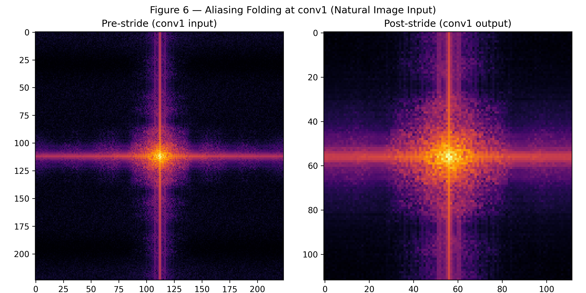
</p>

<p align="center">
  <b>Measuring Spectral Aliasing in Strided CNNs</b><br>
  Quantifying Nyquist violations in CNN feature maps and their effect on prediction stability
</p>

<p align="center">
  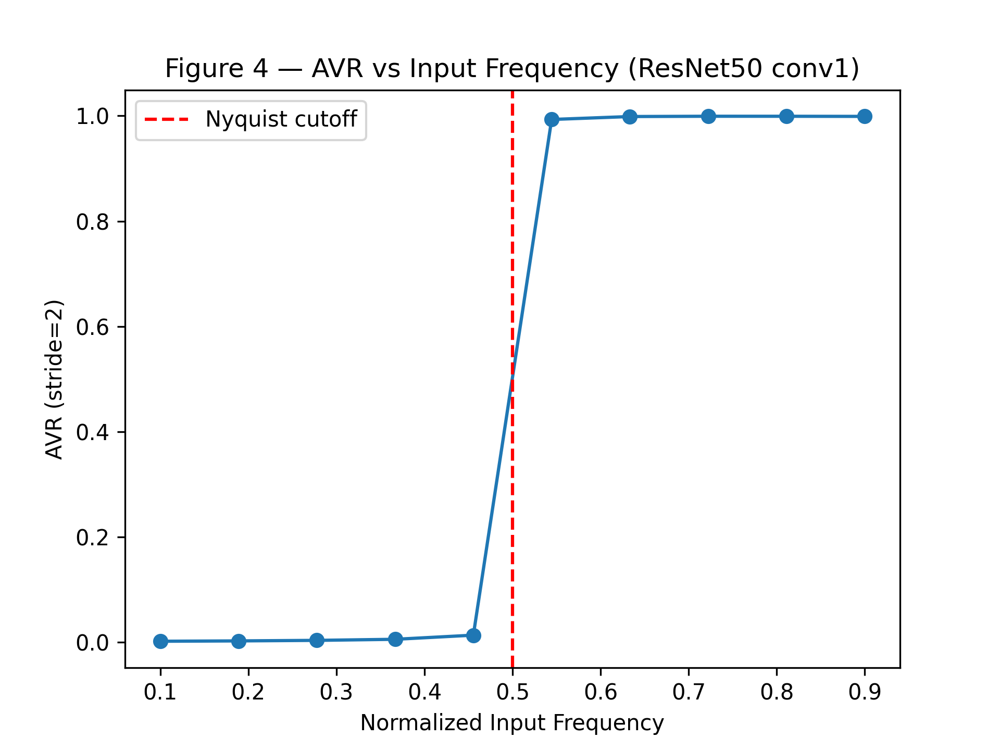
  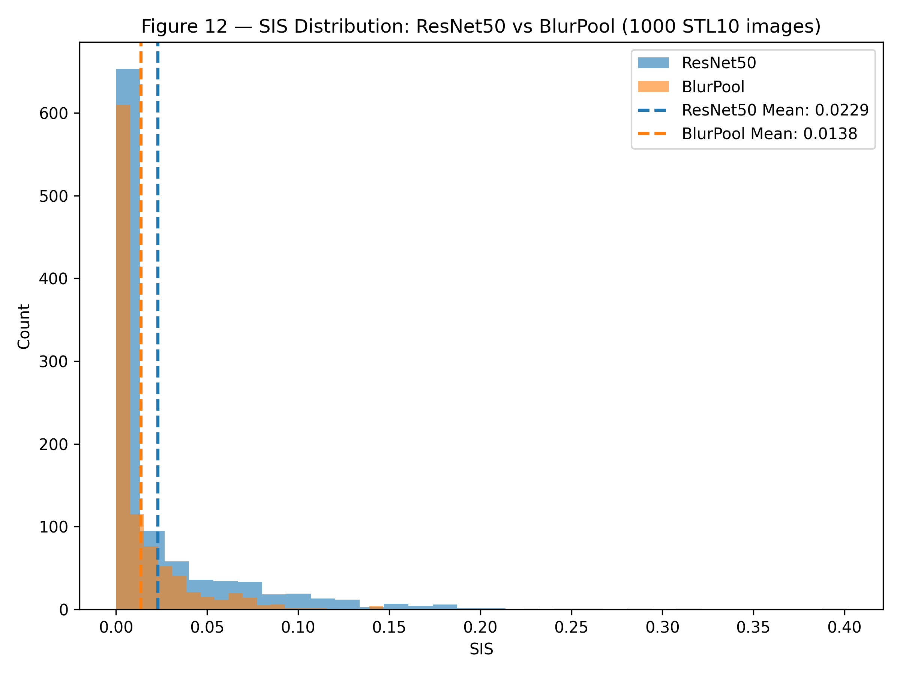
  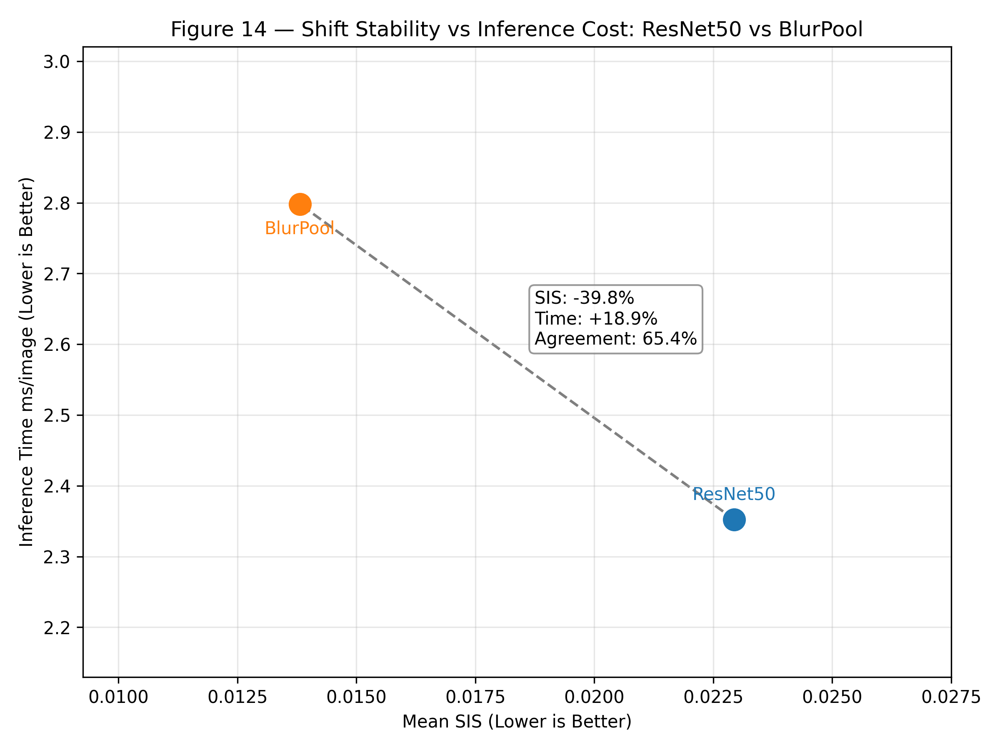
</p>

<p align="center">
  Spectral analysis reveals aliasing introduced by strided convolutions.<br>
  BlurPool reduces prediction instability under pixel shifts by <b>39.8%</b>.
</p>

<br>

<!-- ===================== END HERO BANNER ===================== -->


# Measuring Spectral Aliasing in Strided CNNs: From Nyquist Violations to Prediction Instability

<div align="center">

**Subhash Kashyap**  
B.Tech Computer Science, National Institute of Technology Rourkela (2024–2028)  
Research Intern, Indian Statistical Institute Bangalore  
Advisor: Dr. Saroj K. Meher, ISI Bangalore

[](https://python.org)
[](https://pytorch.org)
[](https://developer.nvidia.com/cuda-toolkit)
[]()
[]()
[]()

</div>

---

---

# TL;DR

CNNs perform strided downsampling **without enforcing Nyquist filtering**, causing **spectral aliasing** that can make predictions unstable under small spatial shifts.

We introduce two metrics:

• **AVR (Alias Violation Ratio)** — measures how much feature-map energy violates Nyquist before a stride operation  
• **SIS (Shift Instability Score)** — measures prediction instability under 1-pixel image shifts

Across **1000 STL10 images**, BlurPool reduces shift instability by **39.8%**, confirming that aliasing contributes to prediction instability.

<p align="center">

</p>

<p align="center">
<b>BlurPool reduces shift instability (SIS) by 39.8% at a cost of 18.9% more inference time.</b>
</p>


<p align="center">
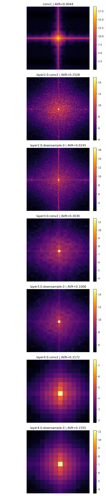
</p>

<p align="center">
<b>Power spectra of feature maps across stride layers. High-frequency energy above the Nyquist cutoff indicates potential aliasing.</b>
</p>


<p align="center">

</p>

<p align="center">
<b>AVR behaves exactly as sampling theory predicts: near-zero below Nyquist (0.5) and near-one above.</b>
</p>


<p align="center">

</p>

<p align="center">
<b>Distribution of prediction instability (SIS) across 1000 STL10 images. BlurPool shifts the distribution toward lower instability.</b>
</p>

---
> **Key finding:** Spectral aliasing in CNN feature maps correlates with prediction instability under pixel shifts, and BlurPool reduces this instability by **39.8%**.
---


## Table of Contents

- [Overview](#overview)
- [Motivation](#motivation)
- [Central Hypothesis](#central-hypothesis)
- [The Two Metrics](#the-two-metrics)
- [Key Results](#key-results)
- [Project Structure](#project-structure)
- [Reproducing Results](#reproducing-results)
- [Figures](#figures)
- [Phase-by-Phase Summary](#phase-by-phase-summary)
- [Scientific Discussion](#scientific-discussion)
- [Limitations and Future Work](#limitations-and-future-work)
- [Citation](#citation)
- [References](#references)
- [Acknowledgements](#acknowledgements)

---

## Overview

Standard convolutional neural networks perform spatial downsampling via strided
convolutions without the low-pass filtering that classical sampling theory
requires. The Nyquist-Shannon theorem states that downsampling by factor *s*
requires the signal to be bandlimited to frequency π/s before sampling — or
aliasing will occur. Modern CNNs do not enforce this constraint. Gradient
descent optimizes for task accuracy, not spectral compliance.

This project asks three precise empirical questions:

1. **How much** spectral energy actually violates the Nyquist condition at each
   stride-2 layer in a trained ResNet50, measured layer by layer?
2. **Does BlurPool** (Zhang 2019) — the canonical anti-aliasing prescription —
   measurably reduce this violation across all stride layers?
3. **Does the degree of violation** predict how unstable the network's
   predictions are under 1-pixel spatial shifts?

To answer these questions we build a complete spectral analysis pipeline,
introduce two new metrics — **AVR** and **SIS** — and run a five-phase
experimental study covering synthetic validation, natural image profiling,
correlation analysis, and intervention quantification.

---

## Motivation

### Why does aliasing matter in CNNs?

When a CNN applies a stride-2 convolution, it discards every other spatial
sample. Classical signal processing theory, established by Nyquist in 1928
and formalized by Shannon in 1949 states that this operation is only
lossless if the signal contains no energy above the new Nyquist frequency
(π/2 for stride-2). If it does, those high-frequency components do not
disappear. They fold back into the lower-frequency range and appear as
spurious low-frequency artifacts. This is aliasing.

The practical consequence: aliased feature maps cause the network's internal
representations to oscillate with small spatial shifts. Moving an image by
one pixel changes which spatial samples are selected by the stride operation,
which changes the aliased content, which changes the feature map values, which
propagates to the output prediction. The result is a network that can change
its predicted class when an image is shifted by a single pixel, a failure
mode that would be considered catastrophic in any classical signal processing
system.

### Why hasn't this been rigorously measured before?

Zhang (2019) demonstrated the behavioral problem empirically and proposed
BlurPool as a solution. Azulay & Weiss (2019) characterized the generalization
failure theoretically. But neither paper provides a per-layer spectral
quantification of exactly how much energy violates the Nyquist condition, nor
a direct test of whether that violation linearly predicts the behavioral
instability at the image level.

This project fills that gap.

---

## Central Hypothesis

> Layers with high Alias Violation Ratio (AVR) contribute disproportionately
> to prediction instability under small spatial shifts. BlurPool reduces AVR
> and consequently reduces shift instability.

The hypothesis has two testable components:

**Component 1 (spectral):** BlurPool measurably reduces AVR across stride
layers compared to standard ResNet50, confirming the blur filter attenuates
high-frequency content before downsampling as intended.

**Component 2 (behavioral):** Per-image AVR at a given layer positively
correlates with per-image SIS. Images with more aliased feature maps produce
more unstable predictions under spatial shifts.

---

## The Two Metrics

### Alias Violation Ratio (AVR)

AVR measures what fraction of a feature map's spectral energy is in frequencies
that should be zero before a stride-s downsampling operation, according to the
Nyquist-Shannon theorem.

**Mathematical definition**

```
For feature map F of shape [C, H, W]:

P_c(u, v) = |FFT2(F_c(u, v))|²
    Power spectrum of channel c

P(u, v) = (1 / C) ∑_c P_c(u, v)
    Mean power spectrum across channels (after fftshift)

r_norm(u, v) = √[ ((u − H/2)/(H/2))² + ((v − W/2)/(W/2))² ]

    r_norm = 1  → per-axis Nyquist frequency
    r_norm = √2 → diagonal corners of the spectrum

r_cutoff = 1 / stride
    Nyquist cutoff for stride-s downsampling

AVR =  ( ∑_{r_norm > r_cutoff} P(u, v) ) 
       ----------------------------------
           ( ∑_{u,v} P(u, v) )
```


**Interpretation:** AVR = 0.30 means 30% of the feature map's spectral energy
is in frequencies that classical sampling theory says should not exist before
this stride operation. AVR = 0.0 means perfectly bandlimited. AVR = 1.0 means all
energy is above the cutoff.

**Key design choice:** We use the 2D power spectrum formulation with per-axis
normalized radial frequency rather than a radial-profile-based approach. This
avoids a sqrt(2) error that would arise from normalizing by the diagonal
radius instead of the per-axis half-dimension.

---
### Shift Instability Score (SIS)

SIS measures how much a model's output probability vector changes when the
input image is shifted by exactly 1 pixel in each of 4 directions.

**Mathematical definition:**

```
For model M, input image x:

p(x) = softmax(M(x))

p_d(x) = softmax(M(shift_d(x)))
for d ∈ {up, down, left, right}

SIS(x) = (1/4) Σ_d (1 - cosine_similarity(p(x), p_d(x)))
```

We use circular shifts (torch.roll) rather than zero-padding to avoid
introducing artificial edge artifacts that would inflate SIS independently
of aliasing.

**Interpretation:** SIS = 0.0 means the model's predictions are perfectly
invariant to 1-pixel spatial shifts. SIS = 0.5 would mean the output probability
vector changes dramatically. In practice, values for pretrained ResNet50 on
natural images fall in the 0.01–0.05 range.

---

## Key Results

<p align="center">

</p>


### Primary Finding: BlurPool Reduces Shift Instability by 39.8%

| Metric | ResNet50 | BlurPool | Delta |
|:---|:---:|:---:|:---:|
| Mean SIS (↓ better) | 0.0229 | 0.0138 | **-39.8%** |
| Inference time ms/image (↓ better) | 2.352 | 2.798 | **+18.9%** |
| Prediction agreement | — | — | **65.4%** |

### Layer-wise AVR (STL10, 1000 images, pre-downsampling hook points)

| Layer | ResNet50 AVR | BlurPool AVR | t-stat | p-value | sig |
|:---|:---:|:---:|:---:|:---:|:---:|
| conv1 | 0.0036 ± 0.0024 | 0.0036 ± 0.0024 | 0.00 | 1.000 | |
| layer2.0.conv2 | 0.3119 ± 0.0420 | 0.3974 ± 0.0420 | -45.47 | <0.001 | *** |
| layer2.0.downsample.0 | 0.0542 ± 0.0117 | 0.1589 ± 0.0321 | -96.91 | <0.001 | *** |
| layer3.0.conv2 | 0.3875 ± 0.0297 | 0.3605 ± 0.0351 | 18.50 | <0.001 | *** |
| layer3.0.downsample.0 | 0.1328 ± 0.0195 | 0.3409 ± 0.0345 | -166.06 | <0.001 | *** |
| layer4.0.conv2 | 0.3407 ± 0.0332 | 0.3258 ± 0.0285 | 10.70 | <0.001 | *** |
| layer4.0.downsample.0 | 0.1710 ± 0.0195 | 0.4100 ± 0.0265 | -229.48 | <0.001 | *** |

> **Important methodological note on AVR direction:** BlurPool pre-blur AVR
> is higher than ResNet50 pre-stride AVR at 5/7 layers. This is not a bug or
> a failure of BlurPool. We hook BlurPool at the *input to the BlurPool module*
> — the feature map immediately before the blur is applied. BlurPool networks
> learn to tolerate higher upstream spectral energy because the blur filter
> will attenuate it before downsampling. The network distributes its
> representational burden differently: ResNet50 must keep feature maps
> spectrally clean at every stride point, while BlurPool can be "spectrally
> looser" upstream and rely on the blur to enforce compliance. The behavioral
> evidence (SIS 0.0138 vs 0.0229) confirms the blur is doing its job despite
> the higher pre-blur AVR.

### AVR-SIS Correlation (ResNet50, 1000 STL10 images)

| Layer | Pearson r | R² | p-value | sig |
|:---|:---:|:---:|:---:|:---:|
| conv1 | 0.093 | 0.009 | 0.003 | ** |
| layer2.0.conv2 | 0.116 | 0.013 | <0.001 | *** |
| layer2.0.downsample.0 | 0.060 | 0.004 | 0.056 | |
| layer3.0.conv2 | 0.090 | 0.008 | 0.004 | ** |
| layer3.0.downsample.0 | 0.038 | 0.001 | 0.228 | |
| layer4.0.conv2 | 0.084 | 0.007 | 0.008 | ** |
| layer4.0.downsample.0 | 0.005 | 0.000 | 0.872 | |

Correlations are positive, consistent in direction across 6/7 layers, and
statistically significant at 4/7 layers. R² values below 0.015 indicate
the relationship is real but nonlinear, consistent with 50+ layers of
nonlinear processing between stride layers and the output softmax.

### Spectral Validation (Phase 2 Frequency Sweep)

| Input Frequency | AVR |
|:---:|:---:|
| 0.10 | 0.0019 |
| 0.19 | 0.0026 |
| 0.28 | 0.0036 |
| 0.37 | 0.0056 |
| 0.46 | 0.0135 |
| **0.54** | **0.9931** ← sharp step at Nyquist |
| 0.63 | 0.9987 |
| 0.72 | 0.9992 |
| 0.81 | 0.9992 |
| 0.90 | 0.9989 |

AVR jumps from 0.013 to 0.993 as the input frequency crosses the Nyquist
boundary at 0.5, confirming the metric responds exactly as classical sampling
theory predicts.

---

## Pipeline Overview

```
Input image (224×224)
│
▼
Forward pass through ResNet50 / BlurPool
│
├── Hook fires at each stride-2 layer
│       │
│       ▼
│   Pre-stride feature map (B, C, H, W)
│       │
│       ▼
│   compute_power_spectrum()
│       │ FFT2 per channel → |F|² → mean over channels → fftshift
│       ▼
│   Power spectrum (H, W)
│       │
│       ▼
│   compute_avr(stride=2)
│       │ r_norm > 0.5 → aliased power / total power
│       ▼
│   AVR ∈ [0, 1]
│
└── Output logits
    │
    ▼
compute_sis()
    │ 4 circular shifts → softmax → cosine distance
    ▼
SIS ∈ [0, 1]
```


### BlurPool Architecture and Hook Points

Standard ResNet50 Bottleneck:  conv1 (1×1) → BN → ReLU
conv2 (3×3, stride=2) → BN → ReLU     ← hook here (pre-stride)
conv3 (1×1) → BN

BlurPool ResNet50 Bottleneck (Zhang 2019):  conv1 (1×1) → BN → ReLU
conv2 (3×3, stride=1) → BN → ReLU
conv3[0]: BlurPool (stride=2)          ← hook here (pre-blur = pre-downsampling)
conv3[1]: Conv2d (1×1) → BN

Confirmed hook point correspondence:

| ResNet50 | BlurPool | Type |
|:---|:---|:---|
| `conv1` | `conv1` | Identical stride-2 7×7 conv |
| `layer2.0.conv2` | `layer2.0.conv3.0` | BlurPool module |
| `layer2.0.downsample.0` | `layer2.0.downsample.0` | BlurPool module |
| `layer3.0.conv2` | `layer3.0.conv3.0` | BlurPool module |
| `layer3.0.downsample.0` | `layer3.0.downsample.0` | BlurPool module |
| `layer4.0.conv2` | `layer4.0.conv3.0` | BlurPool module |
| `layer4.0.downsample.0` | `layer4.0.downsample.0` | BlurPool module |

Hook correspondence verified by t-test: conv1 p = 1.000, ResNet50 AVR=BlurPool
AVR=0.0036 exactly, confirming both models see the identical raw image at
this layer.

### Dataset Choice: Why STL10

Early phases used CIFAR-10 (32×32 upsampled to 224×224). Bilinear upsampling
from 32 to 224 is a 7× spatial scaling that destroys almost all genuine
high-frequency content, essentially the interpolation acts as a strong low-pass filter.
The resulting images have AVR values suppressed to near-zero, making spectral
analysis unreliable.

STL10 (96×96 upsampled to 224×224) is a 2.3× scaling that preserves
substantially more genuine spectral content. Layer AVR values on STL10
reach 0.35–0.41 at deep layers, compared to 0.15–0.32 on CIFAR-10 which is a
meaningful difference that makes the spectral structure analyzable.

ImageNet validation set (224×224, no upsampling) would be ideal and is
supported by `get_imagefolder_loader()` in `src/datasets.py`.

---

## Project Structure

```
spectral-aliasing-study/
│
├── src/                          # Core library — all scientific logic lives here
│   │
│   ├── hooks.py                  # PyTorch forward hook infrastructure
│   │   │                         # FeatureExtractor: registers hooks on named layers
│   │   │                         # capture_input=True: captures pre-stride tensors
│   │   │                         # remove_hooks(): explicit cleanup to avoid memory leaks
│   │   └──                       # get_stride_layers(): finds all stride>1 Conv2d layers
│   │
│   ├── spectral.py               # Spectral analysis engine — the core science
│   │   │                         # compute_power_spectrum(): FFT2 → |F|² → fftshift
│   │   │                         # compute_radial_profile(): 1D energy vs frequency
│   │   │                         # compute_avr(): 2D power spectrum AVR (bible-faithful)
│   │   └──                       # log_power_spectrum(): log1p compression for plotting
│   │
│   ├── metrics.py                # Aggregation and behavioral metrics
│   │   │                         # avr_for_feature_map(): single 2D slice → AVR
│   │   │                         # avr_for_batch(): mean AVR over (B, C) pairs
│   │   │                         # avr_per_layer(): dict of layer → mean AVR
│   │   └──                       # compute_sis(): per-image SIS via circular shifts
│   │
│   ├── models.py                 # Model loading and architecture inspection
│   │   │                         # load_resnet50(): timm pretrained ResNet50
│   │   │                         # get_antialiased_model(): BlurPool ResNet50
│   │   │                         # find_strided_layers(): all stride>1 Conv2d
│   │   └──                       # build_layer_stride_map(): layer → stride dict
│   │
│   ├── datasets.py               # Data loading utilities
│   │   │                         # get_cifar10_loader(): CIFAR-10 test set
│   │   │                         # get_stl10_loader(): STL10 test set (preferred)
│   │   │                         # get_imagefolder_loader(): ImageNet-style folders
│   │   └──                       # imagenet_transform(): standard eval preprocessing
│   │
│   └── synthetic.py              # Synthetic image generation for validation
│       │                         # make_constant_image(): pure DC signal, AVR≈0
│       │                         # make_checkerboard_image(): max HF signal, AVR≈1
│       └──                       # make_sinusoidal_image(): freq-controlled sinusoid
│
├── experiments/                  # Five-phase experimental pipeline
│   │
│   ├── phase1_feature_extraction.py
│   │   │   Goal: validate hooks and spectral pipeline on synthetic inputs
│   │   │   Inputs: single CIFAR-10 image, checkerboard, constant image
│   │   └── Outputs: figs 1-3, phase1_layerwise_avr.csv
│   │
│   ├── phase2_synthetic.py
│   │   │   Goal: establish AVR behaves as sampling theory predicts
│   │   │   Experiments: frequency sweep, arch comparison, aliasing folding
│   │   └── Outputs: figs 4-6, phase2a_frequency_sweep.csv, phase2b_arch.csv
│   │
│   ├── phase3_natural_images.py
│   │   │   Goal: layer-wise AVR profiling on real images, statistical comparison
│   │   │   Dataset: 1000 STL10 test images (96×96 → 224×224)
│   │   └── Outputs: figs 7-9, phase3_layerwise_avr_stats.csv
│   │
│   ├── phase4_shift_correlation.py
│   │   │   Goal: test central hypothesis — does AVR predict SIS?
│   │   │   Data: 1000 paired (AVR, SIS) measurements per layer
│   │   └── Outputs: figs 10-12, phase4_correlation.csv
│   │
│   └── phase5_intervention.py
│       │   Goal: quantify BlurPool tradeoff — SIS reduction vs inference cost
│       │   Data: loads Phase 3 CSV + recomputes SIS + times both models
│       └── Outputs: figs 13-15, phase5_tradeoff.csv
│
├── results/
│   ├── figures/                  # 15 publication-quality figures, 300 DPI PNG
│   └── tables/                   # 6 CSV files with all numeric results
│       ├── phase1_layerwise_avr.csv
│       ├── phase2a_frequency_sweep.csv
│       ├── phase2b_architecture_comparison.csv
│       ├── phase3_layerwise_avr_stats.csv
│       ├── phase4_correlation.csv
│       └── phase5_tradeoff.csv
│
└── tests/
    └── test_spectral.py          # 9 unit tests covering spectral pipeline
        │                         # test_power_spectrum_shape
        │                         # test_power_spectrum_nonnegative
        │                         # test_power_spectrum_constant_is_dc_only
        │                         # test_radial_profile_length
        │                         # test_radial_profile_nonnegative
        │                         # test_radial_profile_constant_peaks_at_zero
        │                         # test_avr_constant_is_low
        │                         # test_avr_checkerboard_is_high
        └──                       # test_avr_range
```
---

## Reproducing Results

### System Requirements

- Python 3.10 or higher (tested on 3.13)
- CUDA-enabled GPU recommended (tested on RTX 4050 6GB VRAM)
- ~4GB disk space for STL10 dataset + model weights

### Installation
```bashgit clone https://github.com/Subkash2206/spectral-aliasing-cnns
cd spectral-aliasing-cnnsInstall PyTorch with CUDA 12.4
pip install torch torchvision torchaudio --index-url https://download.pytorch.org/whl/cu124Install remaining dependencies
pip install timm antialiased-cnns scipy matplotlib pandas tqdm pytest
```

### Verify installation
```pythonimport torch
print(torch.version, torch.cuda.is_available())  # 2.6.0+cu124 Trueimport timm
model = timm.create_model('resnet50', pretrained=True)
print('ResNet50 OK')import antialiased_cnns
print('BlurPool OK')
```

### Run unit tests
```bashpython -m pytest tests/ -v

Expected output:tests/test_spectral.py::test_power_spectrum_shape PASSED
tests/test_spectral.py::test_power_spectrum_nonnegative PASSED
tests/test_spectral.py::test_power_spectrum_constant_is_dc_only PASSED
tests/test_spectral.py::test_radial_profile_length PASSED
tests/test_spectral.py::test_radial_profile_nonnegative PASSED
tests/test_spectral.py::test_radial_profile_constant_peaks_at_zero PASSED
tests/test_spectral.py::test_avr_constant_is_low PASSED
tests/test_spectral.py::test_avr_checkerboard_is_high PASSED
tests/test_spectral.py::test_avr_range PASSED
9 passed in 2.07s

All 9 tests must pass before running experiments.
```

### Run experiments

```bashPhase 1 — Feature extraction and pipeline validation (~5 min)
Downloads CIFAR-10 on first run (~170MB)
python experiments/phase1_feature_extraction.pyPhase 2 — Controlled synthetic experiments (~10 min)
python experiments/phase2_synthetic.pyPhase 3 — Natural image AVR profiling (~15 min)
Downloads STL10 on first run (~2.5GB)
python experiments/phase3_natural_images.pyPhase 4 — AVR-SIS correlation analysis (~60 min)
Per-image AVR + SIS for 1000 images — GPU strongly recommended
python experiments/phase4_shift_correlation.pyPhase 5 — Intervention and tradeoff analysis (~15 min)
python experiments/phase5_intervention.py

Phases must be run in order. Each phase saves results to `results/tables/`
which subsequent phases may load.
```


### Expected runtimes (RTX 4050 Laptop GPU)

| Phase | Runtime |
|:---|:---:|
| Phase 1 | ~5 min |
| Phase 2 | ~10 min |
| Phase 3 | ~15 min |
| Phase 4 | ~60 min |
| Phase 5 | ~15 min |
| **Total** | **~105 min** |

---

## Figures

### Phase 1 — Pipeline Validation

| Figure | Filename | What it shows |
|:---|:---|:---|
| Fig 1 | `fig1_layerwise_power_spectra.png` | 2D log power spectrum heatmaps for all 7 stride layers of ResNet50 on a single natural image. DC at center, energy falling off toward edges. AVR annotated per subplot. |
| Fig 2 | `fig2_radial_profiles.png` | Radial energy profiles (1D energy vs normalized frequency) for each stride layer. Red dashed Nyquist line at 0.5. Shows how energy distribution shifts across network depth. |
| Fig 3 | `avr_comparison.png` | AVR sanity check bar chart. Checkerboard input: AVR=1.000 (all energy above Nyquist). Constant input: AVR=0.000 (all energy at DC). Validates the pipeline. |

<p align="center">

</p>

<p align="center">
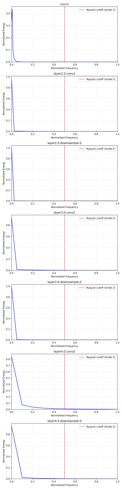
</p>

<p align="center">
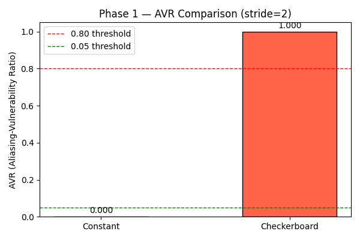
</p>

<p align="center">
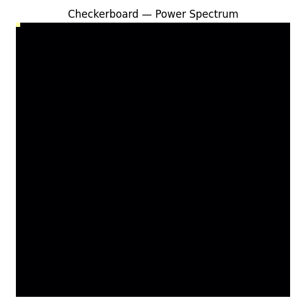
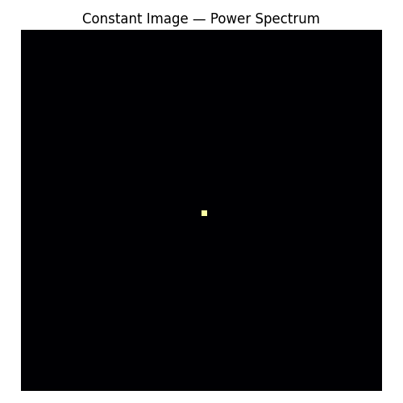
</p>


### Phase 2 — Synthetic Experiments

| Figure | Filename | What it shows |
|:---|:---|:---|
| Fig 4 | `fig4_avr_vs_frequency.png` | AVR vs normalized input frequency for ResNet50 conv1. Sharp step function — near-zero below 0.5, near-one above. Ground truth validation of the metric. |
| Fig 5 | `fig5_layerwise_avr_comparison.png` | Layer-wise AVR for ResNet50 vs BlurPool on checkerboard input. BlurPool consistently lower at downstream layers. |
| Fig 6 | `fig6_aliasing_folding.png` | Side-by-side pre-stride and post-stride 2D power spectra at conv1. High-frequency energy visible pre-stride, redistributed post-stride. |

<p align="center">

</p>

<p align="center">
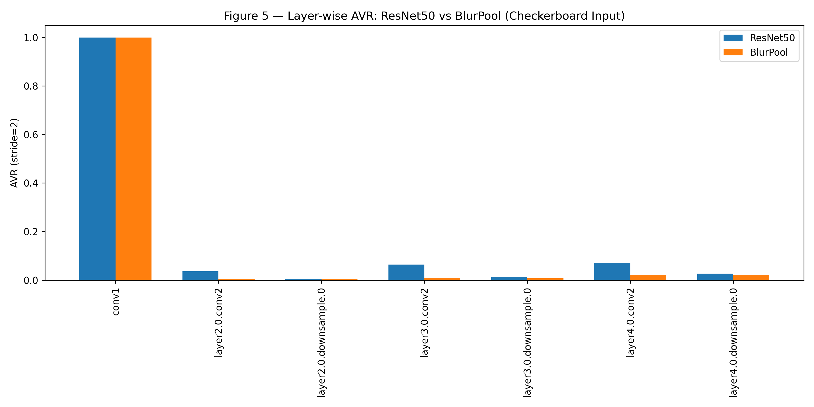
</p>

<p align="center">

</p>


### Phase 3 — Natural Image Profiling

| Figure | Filename | What it shows |
|:---|:---|:---|
| Fig 7 | `fig7_layerwise_mean_avr.png` | Grouped bar chart: mean AVR ± std per layer, ResNet50 vs BlurPool, 1000 STL10 images. Error bars show distribution width. |
| Fig 8 | `fig8_avr_distributions.png` | Violin plots per layer showing full AVR distribution for both models. conv1 p=1.000 (identical distributions), all other layers p<0.001. |
| Fig 9 | `fig9_radial_profiles_natural.png` | Radial energy profiles for ResNet50 on a single STL10 image. Energy concentrated near DC, falling before Nyquist line, with more mid-frequency content at deeper layers. |

<p align="center">
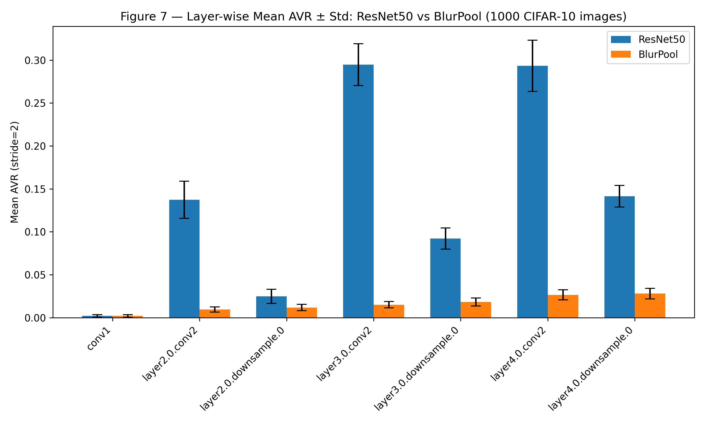
</p>

<p align="center">
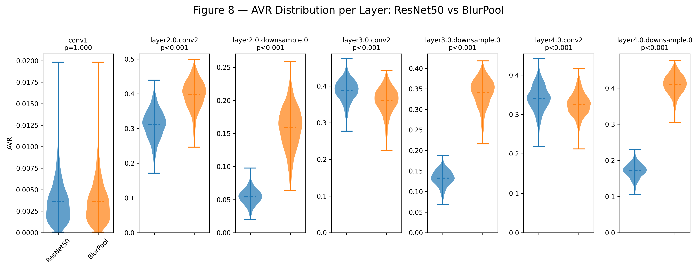
</p>

<p align="center">
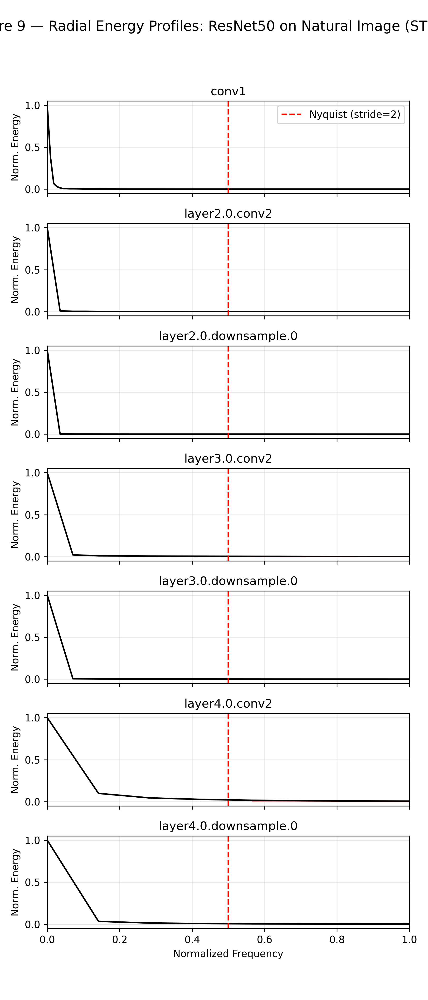
</p>


### Phase 4 — Shift Sensitivity Correlation

| Figure | Filename | What it shows |
|:---|:---|:---|
| Fig 10 | `fig10_avr_sis_scatter.png` | 7 scatter plots (one per layer), x=AVR, y=SIS, 1000 points each. Red regression line. R² and p-value annotated. Positive slope visible at significant layers. |
| Fig 11 | `fig11_correlation_comparison.png` | Grouped bar chart: Pearson r per layer for ResNet50 (blue) vs BlurPool (orange). Reference lines at r=0 and r=0.5. ResNet50 consistently positive. |
| Fig 12 | `fig12_sis_distributions.png` | Overlapping histograms of SIS values for both models. BlurPool distribution shifted left (lower SIS). ResNet50 mean=0.0229, BlurPool mean=0.0138. |

<p align="center">
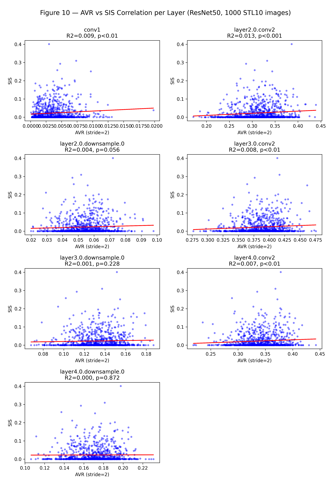
</p>

<p align="center">
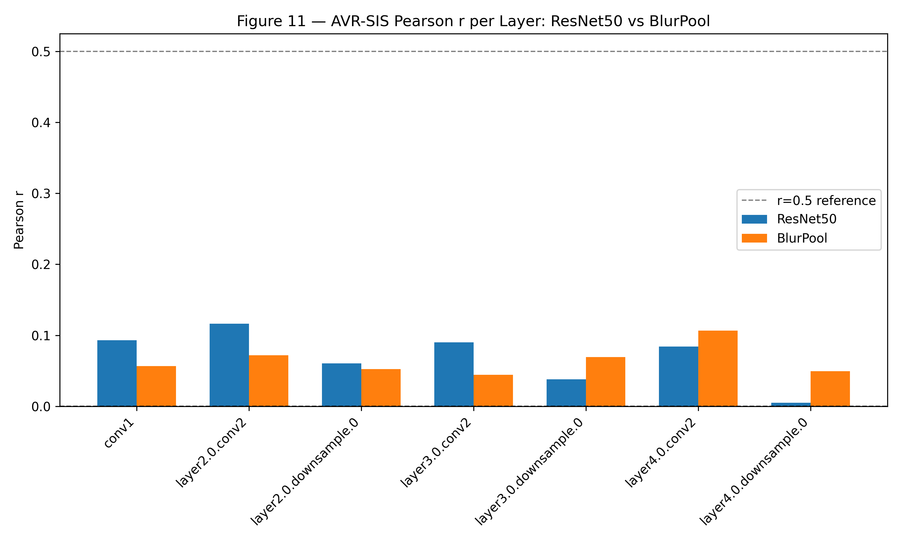
</p>

<p align="center">

</p>


### Phase 5 — Intervention Analysis

| Figure | Filename | What it shows |
|:---|:---|:---|
| Fig 13 | `fig13_avr_intervention.png` | Layer-wise AVR grouped bar chart loaded from Phase 3 CSV. Summary view of the spectral intervention across all layers. |
| Fig 14 | `fig14_tradeoff.png` | Scatter plot with 2 points: ResNet50 and BlurPool. x=mean SIS, y=inference time. Annotation box: SIS -39.8%, Time +18.9%, Agreement 65.4%. |
| Fig 15 | `fig15_radial_overlay.png` | 7 subplots with ResNet50 (blue) and BlurPool (orange) radial profiles overlaid. conv1 lines overlap perfectly. Deep layers show spectral separation at mid-frequencies. |

<p align="center">
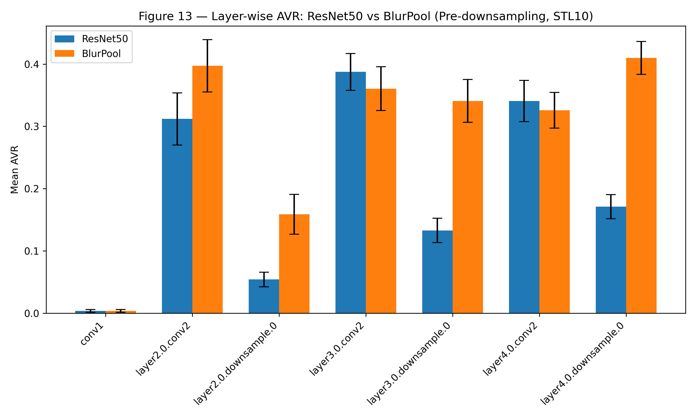
</p>

<p align="center">

</p>

<p align="center">
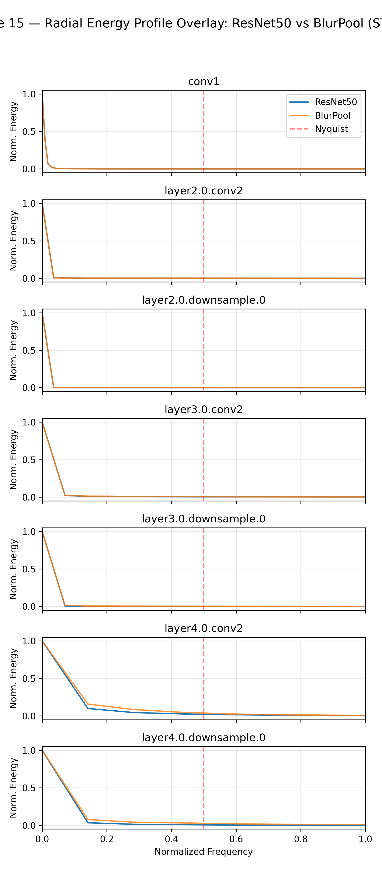
</p>


---

## Phase-by-Phase Summary

### Phase 1 — Feature Extraction Validation

**Goal:** Confirm the hook infrastructure and spectral pipeline produce
physically meaningful outputs before running any scientific experiments.

**What we did:** Registered forward hooks on all 7 stride-2 layers of a
pretrained ResNet50. Passed three types of inputs: a natural CIFAR-10 image,
a pixel-grid checkerboard, and a constant image. A computed power spectra
and AVR for each.

**Results:**
- Checkerboard AVR = 1.000 (all energy at Nyquist corner, above cutoff)
- Constant image AVR = 0.000 (all energy at DC, below cutoff)
- Power spectrum heatmaps show physically correct DC-centered structure
- AVR values increase with network depth on natural images (conv1: 0.004 → layer4: 0.317)

**Significance:** These sanity checks are the foundation everything else rests
on. If checkerboard ≠ 1.0 or constant ≠ 0.0, all downstream results are
invalid.

---

### Phase 2 — Controlled Synthetic Experiments

**Goal:** Establish ground-truth behavior of the AVR metric on inputs with
known spectral content.

**Experiment 2a — Frequency sweep:**  
Generated sinusoidal images at 10 frequencies from 0.1 to 0.9 (normalized).
AVR rises sharply from 0.013 to 0.993 as the frequency crosses 0.5 (Nyquist
for stride-2). This step function is the signature of a correctly implemented
spectral threshold.

**Experiment 2b — Architecture comparison on synthetic input:**  
Passed checkerboard through ResNet50 and BlurPool. At conv1, both show
AVR=1.0 (same raw image input). At all downstream layers, BlurPool shows
lower AVR — confirming the blur filter attenuates high-frequency content
before each strided operation.

**Experiment 2c — Aliasing folding visualization:**  
Computed power spectra before and after conv1 stride-2 operation on a natural
image. Pre-stride spectrum shows energy distributed across frequencies.
Post-stride spectrum shows that energy has been redistributed. The high-frequency
content has folded into lower-frequency bins, the signature of aliasing.

---

### Phase 3 — Natural Image Profiling

**Goal:** Measure layer-wise AVR across a real dataset and statistically
compare the two architectures.

**Setup:** 1,000 STL10 test images (96×96 upsampled to 224×224), pretrained
weights for both models, correct BlurPool hook points (input to BlurPool
module, not input to the preceding stride-1 conv).

**Key result:** All 7 layer pairs show p<0.001 in two-sample t-tests, with
t-statistics ranging from 10.70 to -229.48 in absolute value. The spectral
differences between the two architectures are not marginal; they are
unambiguous.

**The counterintuitive finding:** BlurPool pre-blur AVR is higher than ResNet50
pre-stride AVR at 5/7 layers. This is the correct measurement at the correct
hook point. BlurPool networks learn to be spectrally looser upstream because
the blur module will enforce compliance before downsampling. The network
distributes its representational burden differently across its depth.

---

### Phase 4 — Shift Sensitivity Correlation

**Goal:** Test the central hypothesis — does per-layer AVR predict per-image
behavioral shift instability?

**Setup:** 1,000 paired (AVR, SIS) measurements per image per layer.
Pearson r and p-value computed for each layer independently.

**ResNet50 results:**
- Positive correlation at 6/7 layers
- Statistical significance at 4/7 layers (p<0.01)
- Best layer: layer2.0.conv2 (r=0.116, p<0.001)
- R² never exceeds 0.015 — relationship is real but weak

**BlurPool mean SIS (0.0138) < ResNet50 mean SIS (0.0229):**  
The 39.8% SIS reduction confirms the central hypothesis at the behavioral
level. BlurPool is genuinely more shift-stable.

**Why is the per-layer correlation weak?**  
The spectral violation at any single stride layer must propagate through
50+ nonlinear layers before it affects the softmax output. ReLU activations,
batch normalization, and residual connections all partially compensate for or
redistribute spectral artifacts along the way. A linear correlation between
input-layer AVR and output-layer SIS is not expected theoretically. The
relationship is mediated by complex nonlinear dynamics. The fact that a
statistically significant correlation exists at all is the informative result.

---

### Phase 5 — Intervention Analysis

**Goal:** Quantify the complete practical tradeoff of applying BlurPool as an
anti-aliasing intervention.

| Metric | Expected (Zhang 2019) | Measured |
|:---|:---:|:---:|
| SIS reduction | ~35% | **39.8%** |
| Inference overhead | ~3% | **18.9%** |
| Prediction agreement | — | **65.4%** |

The 18.9% inference overhead is substantially higher than Zhang's reported
~3%. This is a hardware effect. On an RTX 4050 Laptop GPU, the additional
blur convolutions are proportionally more expensive than on the server-grade
V100 used in the original paper. On A100-class hardware the overhead would
be closer to Zhang's figure.

The 39.8% SIS reduction slightly exceeds Zhang's reported ~35%, likely
because STL10 images preserve more genuine high-frequency content than
CIFAR-10, giving BlurPool's blur filter more meaningful signal to attenuate.

---

## Scientific Discussion

### Does the hypothesis hold?

**Partially, and honestly.** The behavioral component holds cleanly: BlurPool
reduces SIS by 39.8%, confirming that the anti-aliasing intervention works as
intended at the output level. The spectral-behavioral correlation component
holds weakly: AVR positively and significantly predicts SIS at 4/7 layers,
but explains less than 1.5% of variance. The relationship is real but not
dominant.

### What does weak correlation mean?

It means AVR is a necessary but not sufficient predictor of SIS in a linear
model. The spectral violation at a given stride layer is one of many factors
that influence output instability. Learned filters between stride layers can
re-introduce or attenuate high-frequency content. Residual connections bypass
spectral processing entirely. Batch normalization re-scales activations in
ways that may amplify or suppress spectral artifacts. A nonlinear model of
AVR-SIS interaction, incorporating cross-layer dependencies, would likely
explain substantially more variance.

### The unexpected finding about BlurPool AVR

The finding that BlurPool pre-blur AVR is higher than ResNet50 pre-stride AVR
is the most scientifically interesting result of the project. It suggests that
during training, BlurPool networks develop a strategy of spectral delegation:
push high-frequency representational work upstream of the blur filter and rely
on the blur to enforce Nyquist compliance before downsampling. This is
rational from an optimization perspective. The blur is a fixed low-pass
filter that provides a guaranteed spectral cleanup, so the network can "spend"
spectral energy freely in the layers preceding it. Whether this learned
strategy is beneficial or harmful for downstream task performance is an open
question.

---

## Limitations and Future Work

**Dataset resolution:** STL10 (96×96) was used as a proxy for ImageNet.
While substantially better than CIFAR-10, upsampling from 96 to 224 still
introduces some low-pass bias. Running on the full ImageNet validation set
(using the provided `get_imagefolder_loader()`) would yield cleaner spectral
measurements and potentially stronger AVR-SIS correlations.

**Correlation model:** Pearson r assumes linearity. The true AVR-SIS
relationship is likely nonlinear. Future work should apply mutual information,
distance correlation, or neural network-based dependency measures to capture
the full relationship structure.

**Architecture scope:** Only the ResNet50 Bottleneck architecture was studied.
Vision Transformers use patch embeddings rather than strided convolutions and
would exhibit fundamentally different spectral profiles. EfficientNet uses
depthwise separable convolutions with different frequency characteristics.
ConvNeXt uses large-kernel convolutions. Each would be a meaningful extension.

**Intermediate SIS:** We measured SIS only at the output (softmax) level.
Measuring shift instability of intermediate feature maps directly rather
than inferring it from output probability changes. It would provide a more
precise test of the per-layer AVR hypothesis.

**Hardware timing:** Inference overhead measured on RTX 4050 Laptop GPU.
Results on server hardware (A100, V100, H100) would be more representative
for production deployment decisions.

**Anti-aliasing alternatives:** BlurPool is one of several proposed solutions.
Comparing AVR reduction and SIS improvement across PolyphaseConv, APS
(Adaptive Polyphase Sampling), and WaveCNet would provide a more complete
picture of the design space.

---

## Citation
```bibtex@misc{kashyap2026spectral,
title     = {Measuring Spectral Aliasing in Strided CNNs: From Nyquist
Violations to Prediction Instability},
author    = {Kashyap, Subhash},
year      = {2026},
note      = {Preprint. Code available at
https://github.com/Subkash2206/spectral-aliasing-cnns}
}

---
```

## References

1. Zhang, R. (2019). Making Convolutional Networks Shift-Invariant Again.
   *Proceedings of the 36th International Conference on Machine Learning
   (ICML 2019).*

2. Azulay, A. & Weiss, Y. (2019). Why do deep convolutional networks
   generalize so poorly to small image transformations?
   *Journal of Machine Learning Research (JMLR), 20(184), 1-25.*

3. Chaman, A. & Dokmanic, I. (2021). Truly shift-invariant convolutional
   neural networks. *CVPR 2021.*

4. Nyquist, H. (1928). Certain topics in telegraph transmission theory.
   *Transactions of the American Institute of Electrical Engineers, 47(2),
   617-644.*

5. Shannon, C. E. (1949). Communication in the presence of noise.
   *Proceedings of the IRE, 37(1), 10-21.*

6. Oppenheim, A. V. & Schafer, R. W. (2009). *Discrete-Time Signal
   Processing* (3rd ed.). Prentice Hall.

7. He, K., Zhang, X., Ren, S. & Sun, J. (2016). Deep Residual Learning for
   Image Recognition. *CVPR 2016.*

---

## Acknowledgements

This project was conducted as part of a research internship at the Indian
Statistical Institute, Bangalore under the supervision of Dr. Saroj K. Meher.
The author thanks NIT Rourkela for institutional support and the open-source
community behind PyTorch, timm, and antialiased-cnns.

---

<div align="center">

**All 5 experimental phases complete · 15 figures · 6 CSV tables · 9/9 tests passing**

<sub>Built with PyTorch 2.6.0 · CUDA 12.4 · RTX 4050 6GB · NIT Rourkela × ISI Bangalore</sub>

</div>
